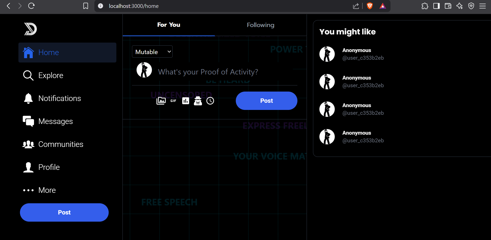
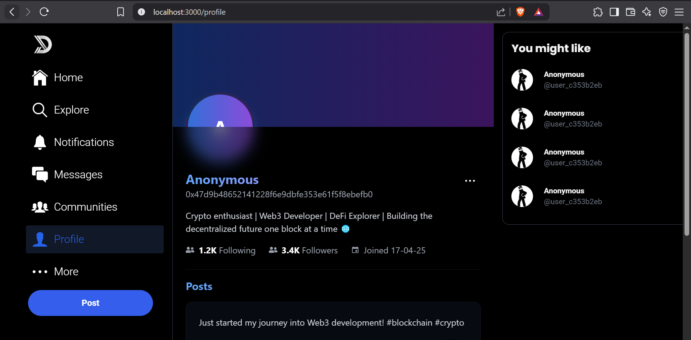
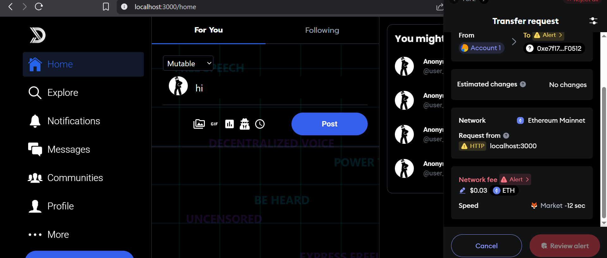

# Decentralized-X 🐦

A decentralized microblogging platform built on blockchain technology - giving power back to the users.

## 🚀 Features

- Decentralized Infrastructure: Built on blockchain for censorship resistance
- Self-Sovereign Identity: Own your data and digital identity
- No Central Authority: Community-driven governance and moderation
- Real-time Updates: Live feed and notifications
- Data Persistence: Robust database architecture

## 🛠 Tech Stack

### Frontend (Client)
- React 18 - UI framework
- TypeScript - Type safety
- TailwindCSS - Styling
- Redux Toolkit - State management
- Ethers.js - Blockchain interactions
- Metamask and wagmi - Authentication
- React Query - Data fetching
- Web3.js - Blockchain integration
- Socket.io-client - Real-time communications

### Backend (Server)
- NestJS - Backend framework
- Prisma - ORM
- PostgreSQL - Primary database
- Firebase Admin - Server-side auth
- TypeScript - Type safety
- Socket.io - WebSocket server
- JWT - Token authentication
- Web3 - Smart contract interactions

## 🏃‍♂ Getting Started

### Client Setup

1. Go to client directory
```
cd client
```

2. Install dependencies
```
npm install
```

3. Setup hardhat
```
npx hardhat node
```

5. Deploy your contract
```
make deploy
```

### Server Setup

1. Go to server directory
```
cd server
```

2. Install dependencies
```
npm install
```

3. Setup prisma
```
npx prisma generate
npx prisma studio
```

4. Run the server
```
npm run start:dev
```

### Environment Variables

#### Client (.env)
```
REACT_APP_UUID_NAMESPACE="" 
REACT_APP_PINATA_API_KEY="" 
REACT_APP_PINATA_API_SECRET="" 
REACT_APP_FIREBASE_API_KEY="" 
REACT_APP_FIREBASE_AUTH_DOMAIN="" 
REACT_APP_FIREBASE_PROJECT_ID="" 
REACT_APP_FIREBASE_STORAGE_BUCKET="" 
REACT_APP_FIREBASE_MESSAGING_SENDER_ID="" 
REACT_APP_FIREBASE_APP_ID=""
```

#### Server (.env)
```
DATABASE_URL=""
JWT_SECRET=""
```

### Screenshots








